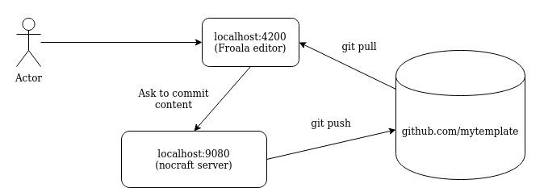

# PoC

Here we have next services:
* nocraft - spring boot base java server capable to commit changes to github
* dev - angular frontend server with WYSIWYG editor
* keycloak - jboss keycloak server (may be used to auth users in some nocraft versions)
* posgres-keycloak - keycloak database

### How to RUN very simply

0) Some assumptions:
    * <user> is bitbuckte username
    * user has imported ssh key, and secret key part resides in `~/.ssh/id_rsa`
    * password is secret ssh key password
    * user has forked repository with correct froala template and has write access to that repository.
1) create `.env` file in same folder where `docker-compose.yaml` is located (in project root)
2) update .env file with next parameters:

```text
GIT_USER=user
GIT_KEYPATH=/home/dmitry/.ssh/id_rsa
GIT_KEYPASSWORD=password
GIT_SSH_REPO=<user>@bitbucket.org:<group>/<repo>.git
GIT_REPO_HTTPS=https://<user>@bitbucket.org/<group>/<repo>.git

```
 3) make sure dev is started
 4) open browser localhost:4200 and make some changes...

## nocraft-server

#### Build

Is assembled from [here](https://bitbucket.org/openchannel/site-backend/src/master/)
Or can be pulled from [here](https://hub.docker.com/repository/docker/dzmitryitechart/nocraft-server)

#### Description

As mentions above - this is simple spring boot server to commit some data to github repository. For simplicity we assume
that we have only one github repository.

We have to configure nocraft server to use this repository.

Please use [github.com](https://github.com). Create developer token for your github: [create token](https://help.github.com/en/github/authenticating-to-github/creating-a-personal-access-token-for-the-command-line)

Current version of nocraft server uses [github rest api](https://github.com/github-api/github-api)

Let assume repository we are going to work with contains correct template. 
Template code can be found [here](https://bitbucket.org/openchannel/site-frontend/src)

Please publish this template on publicly accessible git repository on github.

Configure nocraft server to commit to this repository. To do that, create file called `.env` with values: 
```test
GIT_USER=<username>
GIT_TOKEN=<token>
GIT_REPO=<repository_short_name>
```
for example:
```.env
GIT_USER=user_name
GIT_TOKEN=123456789abcdefgh
GIT_REPO=test
```
here `test` is repository located at `https://github.com/user_name/test`

If you don't want to use `.env` file please edit variables in `docker-compose.yaml` file accordingly.


## dev-server

#### Build

We must to build dev server image locally.

1) Check out locally project: [here](https://bitbucket.org/openchannel/site-frontend/src)
2) run from project root `docker-compose build`. Pay attenton to build container output. Should contain string like: 
```text
Successfully built 57d6ebfd75a0
Successfully tagged keycloak-angular-auth_dev:latest
```
Here we should reference in `docker-compose.yaml` file `dev` server as `keycloak-angular-auth_dev:latest` because we
 have built this container locally.


#### Description

dev is node/angular server wich is running in debug mode from sources located inside running container.

dev server must be configured to use repository with correct template from where code will be used.

Please configure in `.env` file next variables: 
```text
GIT_USERNAME=<git_username>
GIT_REPOSITORY=<repository_short_name>
```
Or if you don't want to use .env file please edit variables inside `docker-compose.yaml` file.

When dev server is stated it has no template source code. It is look into configured `GIT_USERNAME` and `GIT_REPOSITORY`. 
Since we assume that we are working with github only, we construct repository url from this parameters and pull front
 template code from remote repository. Then dev server run regular `npm build` and other tasks to resolve template
 build and runs dev server on 4200 port.
 
 We assume user has access to `localhost:4200`. When user make some changes on site UI, `dev` server doing rest call
  to `nocraft` server sending changed elements and files data. Pay attention - dev server only serving site template
   from inside container source code and does not have write access to remote repository.
   
 From the other hand `nocraft` server has write access. And when we send from UI request to update template `nocraft
 ` server able to create commit and update remote template repository. After commit to remote repository is done
 , `nocraft` server sends notification to `dev` server running angular UI.
 
 When `dev` server receives notification from `nocraft` server it is does `git pull` to update sources from remote
  repository. Since we run angular server in dev mode - changes becomes accessible on UI like it was checked out
   initially. So next time when starting `dev` server container changes will be pulled in remote github.

### Interaction schema




### Prerequisites

Install `docker` and `docker-compose`

Please update dns (`/etc/hosts`) resolution to point to:
```text
127.0.0.1	keycloak
```


### How to run?

**Note:** Please first start postgres (`docker-compose up postgres-keycloak`). Postgres requires to create db volume 
files, so this process may take time.
When started first time together with keycloak, database can be not ready to accept connections. And during first
starts **keycloak may fail to start together** at one time with **postgres**.

Assume we want to start all services all together.
- just run all services
```bash
docker-compose up -d
```

- just run all services and force docker-compose to recreate containers (clear cache).
Useful if you have new versions of images available /
or want to use locally-assembled images.
```bash
docker-compose up -d --force-recreate
```

### Endpoints:

* http://localhost:4200/ - site frontend
* http://localhost:4201/ - site frontend listener port to react on source code updates
* http://localhost:9080/ - service welcome page (redirects to swagger-ui.html)

* http://keycloak:8080/ - keycloak (not used)


### About the Keycloak (no used currently)

For keycloask auth we have to use 3 services:

* nocraft server resides [here](https://bitbucket.org/openchannel/site-backend/src/master/).
* keycloack taken from [here](https://hub.docker.com/r/jboss/keycloak/)
* we use keycloack with postgres db together, so postgres taken from [here](https://hub.docker.com/_/postgres)

First we need to start keycloak. To make keycloak persisted, we use postgres db as data store. Postges data itself is
 stored in mounted volume.
 
 During initial start we import pre-created 'Demo' realm to keycloack. Pay attention that we assume that `nocraft
 ` server is configured to use this default 'Demo' realm.
 
 This can be configured with nocraft server's environment properties. Pay attention to this configuration part:
 ```json
nocraft:
    environment:
      - keycloak.auth-server-url=http://keycloak:8080/auth
```

Also pay attention that we use internal 'docker-compose' network called 
```json
networks:
  keycloak-network:
```
This way inside this network keycloak will be resolved by it's server name automatically.

When operating from browser - which is on the host system, we will get redirect to `keycloak:8080`. This should be
 resolved to localhost since keycloak exposes `8080` port here and all services by default accessible from `127.0.0.1`
